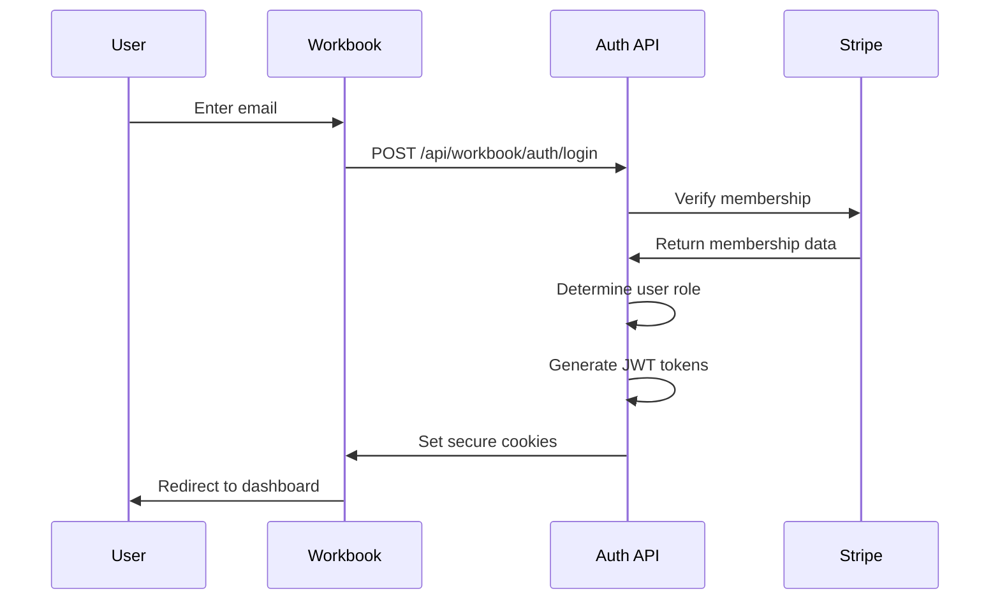
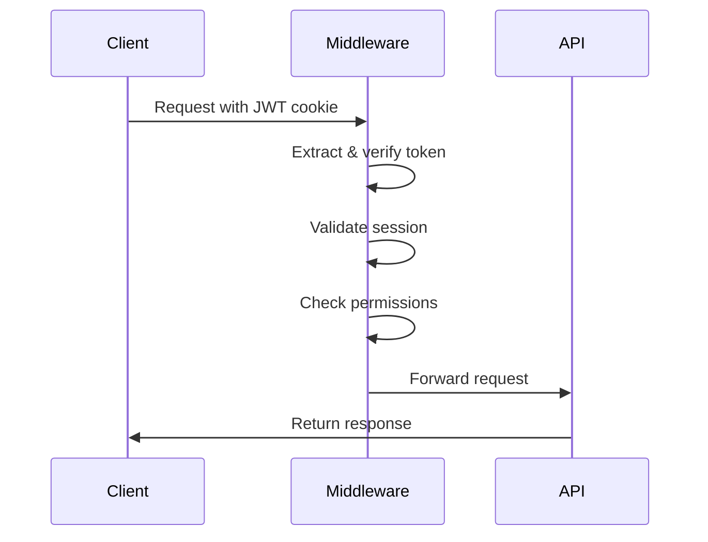

# 6FB Methodologies Workbook Security Implementation

## 🔒 Security Architecture Overview

This document outlines the comprehensive security implementation for the 6FB Workshop Workbook, replacing the demo authentication system with enterprise-grade security controls.

## ✅ Implemented Security Features

### 1. **JWT-Based Authentication System**
- **Location**: `/src/lib/workbook-auth.ts`
- **Features**:
  - Secure token generation with configurable expiration
  - Refresh token mechanism for seamless user experience
  - Session validation with expiration checks
  - Integration with existing Stripe payment system

### 2. **Role-Based Access Control (RBAC)**
- **User Roles**:
  - `BASIC`: View content, save progress
  - `PREMIUM`: Audio recording, transcription, export notes
  - `VIP`: All features plus exclusive VIP content
- **Permission System**: Granular permissions mapped to specific features
- **Dynamic Role Assignment**: Based on Stripe membership verification

### 3. **Secure Audio Functionality**
- **Location**: `/src/lib/secure-audio.ts`
- **Security Controls**:
  - File type and MIME type validation
  - File size limits (25MB max per OpenAI requirements)
  - Content sanitization and signature verification
  - Rate limiting per user role
  - Cost tracking and daily spending limits

### 4. **API Security**
- **Authentication APIs**: `/src/app/api/workbook/auth/*`
  - Login with email verification
  - Secure logout with cookie clearing
  - Token refresh mechanism
  - Session verification endpoint
- **Protected APIs**: Audio transcription and usage tracking
- **Security Headers**: Comprehensive security headers for all responses

### 5. **Rate Limiting & DDoS Protection**
- **Global Rate Limits**: Applied via middleware
- **User-Specific Limits**: Based on role hierarchy
- **Cost Protection**: OpenAI API usage monitoring
- **Redis Backend**: Distributed rate limiting support

### 6. **Content Security Policy (CSP)**
- **Workbook-Specific CSP**: Relaxed for audio functionality
- **OpenAI API Integration**: Secure connections to transcription services
- **Cross-Origin Resource Sharing**: Properly configured for workbook features

## 🛡️ Security Controls by Feature

### Audio Recording & Transcription
```typescript
// Security validations applied:
1. User authentication required
2. Role-based permission check
3. File validation (type, size, content)
4. Rate limiting per user tier
5. Cost tracking and limits
6. Secure API key management
```

### User Session Management
```typescript
// Session security features:
1. JWT with signed tokens
2. Automatic token refresh
3. Secure HTTP-only cookies
4. Session expiration handling
5. CSRF protection
```

### Data Protection
```typescript
// Data security measures:
1. Input validation and sanitization
2. SQL injection prevention
3. XSS protection via CSP
4. Secure error handling
5. Sensitive data masking in logs
```

## 🔐 Authentication Flow

### 1. **User Login Process**


### 2. **API Request Authentication**


## 🚨 Security Monitoring & Alerts

### Rate Limiting Violations
- **Detection**: Automatic detection of limit exceeded
- **Response**: 429 status with retry-after headers
- **Logging**: Security event logging for analysis

### Authentication Failures
- **Brute Force Protection**: Limited login attempts
- **Invalid Token Detection**: Automatic token invalidation
- **Session Hijacking Prevention**: IP and user agent validation

### Cost Monitoring
- **Daily Spending Limits**: Configurable cost thresholds
- **Usage Alerts**: Automatic notifications at warning levels
- **Rate Limiting**: API call restrictions to prevent runaway costs

## 🔧 Configuration & Environment Variables

### Required Environment Variables
```bash
# JWT Authentication
JWT_SECRET=your-super-secure-jwt-secret-key-64-chars-minimum

# OpenAI Integration
OPENAI_API_KEY=sk-proj-your-openai-api-key

# Stripe Integration (already configured)
STRIPE_SECRET_KEY=sk_...

# Database & Redis (optional, for production scale)
DATABASE_URL=postgresql://...
REDIS_URL=redis://localhost:6379

# Cost Management
NEXT_PUBLIC_MAX_DAILY_TRANSCRIPTION_COST=50.00
NEXT_PUBLIC_WARN_TRANSCRIPTION_COST=25.00
```

## 🛠️ Implementation Details

### Authentication Middleware
- **Location**: `/src/middleware/workbook-auth.ts`
- **Usage**: Applied to all `/workbook/*` and `/api/workbook/*` routes
- **Features**: Automatic token validation, permission checking, rate limiting

### User Interface Components
- **WorkbookAuthProvider**: Context provider for authentication state
- **AuthGuard**: Component-level authentication protection
- **RoleGuard**: Role-based content rendering
- **SecureWorkbookWrapper**: Complete security wrapper for workbook features

### API Route Protection
```typescript
// Example protected API route:
export async function POST(request: NextRequest) {
  const authResult = await protectedWorkbookMiddleware(request, {
    requiredPermission: 'transcribe_audio',
    rateLimitAction: 'transcriptions'
  })

  if (authResult) return authResult // Security check failed

  // Proceed with protected operation
}
```

## 📊 Security Testing

### Manual Testing Checklist
- [ ] Authentication with valid 6FB member email
- [ ] Authentication rejection for invalid email
- [ ] Role assignment based on Stripe membership
- [ ] Permission enforcement for audio features
- [ ] Rate limiting at user tier limits
- [ ] Session expiration and refresh
- [ ] Secure logout and cookie clearing
- [ ] CSRF protection on state-changing requests

### Automated Security Scans
- **CSP Validation**: Content Security Policy compliance
- **Dependency Scanning**: Known vulnerability detection
- **Rate Limit Testing**: Automated limit verification
- **Authentication Bypass Testing**: Security control validation

## 🚀 Deployment Security

### Production Checklist
- [ ] JWT_SECRET configured with strong random key
- [ ] HTTPS enforced for all connections
- [ ] Secure cookie settings (httpOnly, secure, sameSite)
- [ ] Rate limiting backend (Redis) configured
- [ ] Database connection secured
- [ ] API keys rotated and secured
- [ ] Security headers verified
- [ ] Error handling sanitized

### Monitoring Setup
- [ ] Authentication failure alerts
- [ ] Rate limit violation notifications
- [ ] Cost threshold warnings
- [ ] Security event logging
- [ ] Performance monitoring

## 🔄 Maintenance & Updates

### Regular Security Tasks
- **Weekly**: Review authentication logs and rate limit violations
- **Monthly**: Rotate JWT secrets and API keys
- **Quarterly**: Security dependency updates and vulnerability scans
- **Annually**: Comprehensive security audit and penetration testing

### Incident Response
1. **Detection**: Automated alerts and monitoring
2. **Assessment**: Security team evaluation
3. **Response**: Immediate threat mitigation
4. **Recovery**: Service restoration and user notification
5. **Lessons Learned**: Process improvement and documentation

## 📚 Additional Resources

### Security Standards Compliance
- **OWASP Top 10**: Protection against common web vulnerabilities
- **JWT Best Practices**: Secure token implementation
- **API Security**: RESTful API security guidelines
- **Data Protection**: PII handling and encryption

### Development Guidelines
- **Secure Coding**: Input validation, output encoding, error handling
- **Testing**: Security test integration and validation
- **Code Review**: Security-focused peer review process
- **Documentation**: Security requirement documentation

---

## 🎯 Security Implementation Summary

The 6FB Methodologies Workbook now features enterprise-grade security with:

✅ **Complete Authentication System** - JWT-based with Stripe integration
✅ **Role-Based Access Control** - BASIC/PREMIUM/VIP tier management
✅ **Secure Audio Processing** - Validated file handling and API integration
✅ **Comprehensive Rate Limiting** - User-tier and cost-based controls
✅ **Security Middleware** - Automated protection for all workbook features
✅ **Production-Ready Configuration** - Scalable security architecture

This implementation replaces the demo authentication system with a robust, secure foundation that integrates seamlessly with the existing 6FB payment and user management infrastructure.